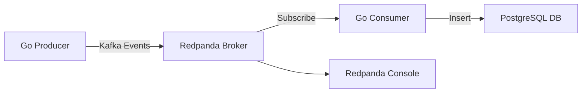
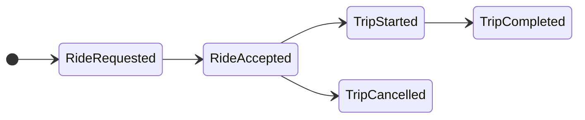

# 🛺 Real-Time Ride Sharing Event Streaming

This project simulates a real-time ride-sharing platform using [Apache Kafka](https://kafka.apache.org/) concepts via [Redpanda](https://redpanda.com/). Events like `trip_requested`, `trip_started`, and `trip_completed` are emitted by a Go-based producer, consumed and stored into PostgreSQL by a Go-based consumer.

> ⚡ Built for local dev using Docker and Dev Containers

---

## 🎯 Features

- Simulated real-time event generation using Go
- Kafka-compatible messaging with Redpanda
- Event processing with a Finite State Machine (FSM)
- Event persistence in PostgreSQL (with JSONB payloads)
- Health checks and container orchestration with Docker Compose
- Optional Redpanda Console for topic visibility

---

## 📦 Architecture



⸻

🗂️ Ride Event Lifecycle

The simulation uses a FSM to model rides:

Each event type (e.g., trip_started) has a specific payload and is written to the ride_events table.

⸻

## 🚀 Getting Started
This repo is designed to be used in VSCode with devcontainers. Simply clone the repo and then in VSCode, open in container. You will then be able to run the make commands, from within the devcontainer, to start/stop/build the other services.

### Prerequisites
- Docker
- Dev Container support
- Go 1.21+ (if building locally)

### Quickstart
#### Create .env file
- Use the template_env file to create a `.env` file to hold variables for accessing the database. 

#### Build binaries and services, start the stack
`make up`

#### View logs
`make logs`

#### Tear down everything, including volumes
`make clean`


⸻

🧱 Services

|Service|	Port|	Description|
|---|---|---|
|Redpanda Broker|	9092	|Kafka-compatible broker|
|Redpanda Console|	8080|	Topic browser (optional)|
|PostgreSQL	|5432	|Stores ride event history|
|Go Producer|	—	|Emits simulated ride events|
|Go Consumer|	—	|Consumes events, writes to Postgres|


⸻

🛢️ PostgreSQL Schema

ride_events table:
```sql
CREATE TABLE ride_events (
    id UUID PRIMARY KEY,
    trip_id TEXT NOT NULL,
    event_type VARCHAR(10) NOT NULL,
    event_state VARCHAR(12) NOT NULL,
    event_time TIMESTAMP NOT NULL,
    driver_id TEXT,
    passenger_id TEXT,
    payload JSONB,
    UNIQUE (trip_id, event_type)
);
```

⸻

🛠️ Makefile Commands

|Command| Description|
|------|----------|
|make up|	Build & start stack|
|make build|	Compile Go producer & consumer|
|make clean	|Remove containers & volumes|
|make logs|	Tail all container logs|
|make test| Run all Go unit tests |

- These commands allow you to quickly iterate over changes and tests within the devcontainer.

⸻

🧪 Test Ideas

- Emit rides for multiple cities
- Simulate cancellations and edge cases
- Observe consumer logs and DB inserts
- View Kafka traffic via Redpanda Console

⸻

📚 Learning Topics
- Kafka fundamentals: partitions, consumer groups
- Exactly-once delivery semantics
  - This is implemented by using `INSERT...ON CONFLICT` in PostgreSQL. This makes the database layer idempotent.  
- Stream processing patterns
- PostgreSQL JSONB storage

⸻

📎 TODO
- [ ]	Test producer under load
- [ ]	Simulate multiple drivers and regions
- [ ]	Add unit tests for FSM

⸻

🧑‍💻 Author

Paul Deveaux

Data Engineer & Go enthusiast

⸻

📝 License

MIT License

---
