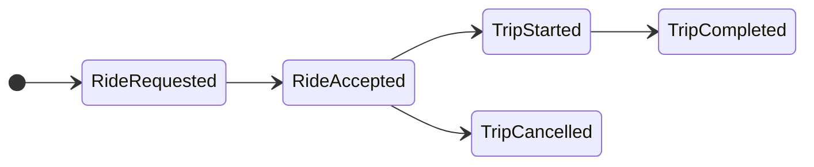

## Real Time Streaming with Kafka
This repo uses the model of a ride sharing application to simulate real time streaming and handling of events with [Apache Kafka](https://kafka.apache.org/). As it is an example meant to be run in containers on a local machine, it uses [Redpanda](https://www.redpanda.com/) instead of Kafka to minimize the resources needed.

I have modeled the producer and the consumer using Go. One could use Python or Java as well here. I chose Go for it's speed and I just like the language. I use Python every day so I wanted a change of pace and I'm super rusty on my Java. 


The project uses a Finite State Machine (FSM) to model the rides as follows:


### Build Notes
Had to use the dynamic tag to force the use of the system `librdkafka`. This is due to the arm64 amd64 issue with the container due to Apple Silicon. 

TODO:
 - [ ] Add redpanda console to Docker compose
    ```yaml
    redpanda-console:
      image: docker.redpanda.com/redpandadata/console:latest
      ports:
        - "8080:8080"
      environment:
        - KAFKA_BROKERS=redpanda:9092
        - SERVER_LISTENPORT=8080
      depends_on:
        - redpanda
    ```
 - [ ] Test producer
 - [ ] Think about creating a stable of drivers to use